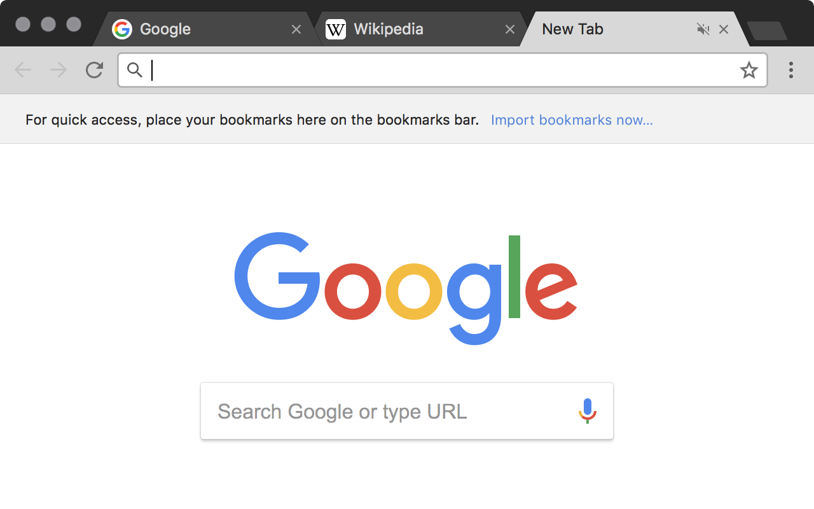

# Slate

A simple, dark theme for Google Chrome.

## Installation

[Install Slate via the Chrome Web Store](https://chrome.google.com/webstore/detail/slate/jkiocfblhkadjnollnbplofmcnbglmnn)

## Screenshots

  
  

## Development

- Clone this repo locally
- Visit [chrome://extensions/](chrome://extensions/)
- Enable "Developer mode" (top right corner)
- Click "load unpacked", then find this extension

## License

MIT
